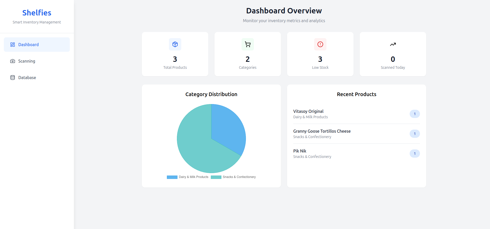
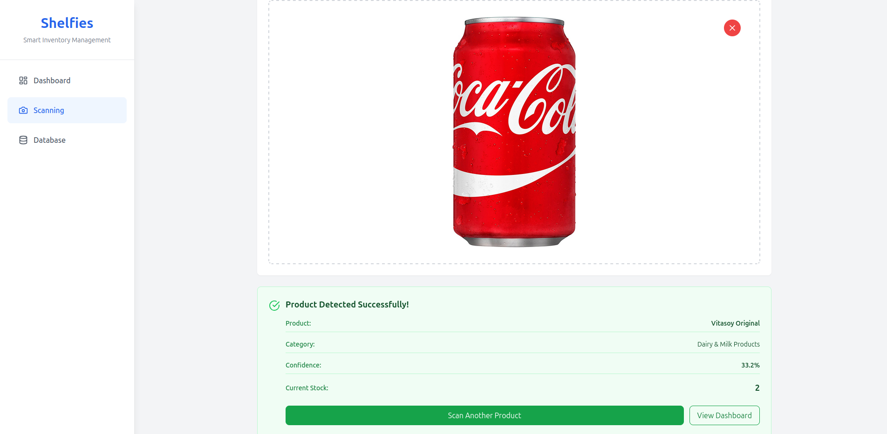
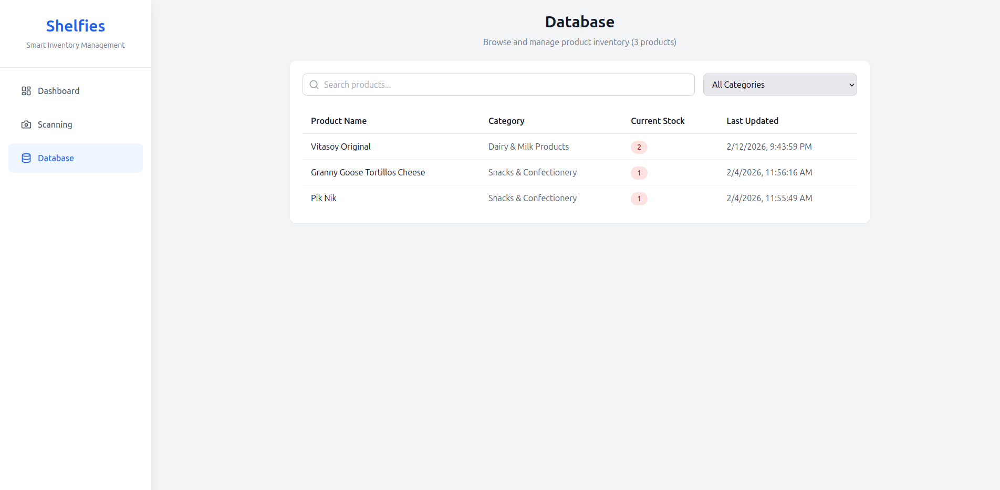

# 🛒 Shelfies - AI-Powered Inventory Management System

An intelligent inventory management system that uses **YOLOv8 object detection** to automatically identify and track products through image scanning.


---

## 🌟 Features

- **AI-Powered Detection** - Custom-trained YOLOv8 model recognizes 294 different products
- **Real-Time Analytics** - Interactive dashboard with charts and statistics
- **Persistent Storage** - SQLite database for reliable data management
- **Smart Search** - Filter and search products by name or category
- **Inventory Tracking** - Monitor stock levels and scan history
- **13 Product Categories** - Organized classification system
- **RESTful API** - Clean API design for easy integration

---

## 🏗️ Architecture
```
┌─────────────────┐         ┌──────────────────┐         ┌─────────────┐
│   React UI      │ ──────> │   Flask API      │ ──────> │  YOLOv8     │
│  (Frontend)     │ <────── │   (Backend)      │ <────── │   Model     │
└─────────────────┘         └──────────────────┘         └─────────────┘
                                     │
                                     ▼
                            ┌─────────────────┐
                            │  SQLite DB      │
                            │  (Persistence)  │
                            └─────────────────┘
```

---

## 🚀 Tech Stack

### **Backend**
- **Flask** - Lightweight web framework
- **SQLAlchemy** - Database ORM
- **YOLOv8** (Ultralytics) - Object detection model
- **Pillow** - Image processing
- **SQLite** - Database
- **uv** - Dependency management

### **Frontend**
- **React** - UI framework
- **Tailwind CSS** - Styling
- **Chart.js** - Data visualization
- **Axios** - HTTP client
- **Vite** - Build tool

### **AI/ML**
- **YOLOv8** - Custom-trained on 294 product classes
- **NumPy** - Numerical operations

---

## 📦 Installation

### **Prerequisites**
- Python 3.12+
- Node.js 18+
- pip & npm

### **1. Clone the Repository**
```bash
git clone https://github.com/nxd010/Shelfies.git
cd shelfies
```

### **2. Backend Setup**
```bash
# Navigate to backend
cd backend

# Create virtual environment (uv recommended)
uv venv
source .venv/bin/activate  # On Windows: .venv\Scripts\activate

# Install dependencies
uv add -r requirements.txt

# Set up environment variables
cp .env.example .env
# Edit .env if needed

# Initialize database
uv run python init_db.py

# Run the server
uv run python app.py
```

Backend will run on **http://localhost:5000**

### **3. Frontend Setup**
```bash
# Navigate to frontend (in a new terminal)
cd frontend

# Install dependencies
npm install

# Set up environment variables
cp .env.example .env
# Edit .env if needed (set VITE_API_URL=http://localhost:5000/api)

# Run development server
npm run dev
```

Frontend will run on **http://localhost:5173**


---

## 🐳 Docker Support

You can run the entire application using Docker Compose.

### **Prerequisites**
- Docker and Docker Compose installed

### **Run with Docker**
```bash
# Build and start services
docker compose up --build -d

# View logs
docker compose logs -f

# Stop services
docker compose down
```

The application will be available at:
- **Frontend:** http://localhost
- **Backend API:** http://localhost:5000

---

## 🎯 Usage

### **1. Access the Application**
Open your browser and navigate to `http://localhost:5173`

### **2. Scan Products**
- Go to the **Scanning** page
- Upload an image of a product or use your webcam
- Click **Process Image**
- The system will detect the product and update inventory automatically

### **3. View Dashboard**
- See real-time statistics (total products, categories, low stock alerts)
- View category distribution chart
- Monitor recently scanned products

### **4. Manage Inventory**
- Navigate to **Database** page
- Search and filter products
- View current stock levels
- Manually adjust counts if needed

---

## 🔌 API Endpoints

### **Product Detection**
```http
POST /api/detect
Content-Type: application/json

{
  "image": "base64_encoded_image_data"
}
```

### **Get All Products**
```http
GET /api/products
GET /api/products?category=Snacks
GET /api/products?search=cola
```

### **Get Statistics**
```http
GET /api/stats
```

### **Update Product**
```http
PUT /api/products/{id}
Content-Type: application/json

{
  "count": 10
}
```

### **Scan History**
```http
GET /api/history?limit=50
```

### **Health Check**
```http
GET /api/health
```

---

## 🗂️ Project Structure
```
shelfies/
├── backend/
│   ├── app.py              # Main Flask application
│   ├── models.py           # Database models
│   ├── config.py           # Configuration management
│   ├── utils.py            # Helper functions
│   ├── init_db.py          # Database initialization
│   ├── requirements.txt    # Python dependencies
│   ├── .env.example        # Environment template
│   ├── data/               # SQLite database (auto-generated)
│   └── models/
│       └── best.pt         # YOLOv8 trained model
│
├── frontend/
│   ├── src/
│   │   ├── components/     # React components
│   │   ├── pages/          # Page components
│   │   ├── utils/          # Utility functions
│   │   └── App.jsx         # Main app component
│   ├── package.json        # Node dependencies
│   └── .env.example        # Environment template
│
└── README.md               # This file
```

---

## 🎓 Product Categories

The system classifies products into 13 categories:

1. 🐟 Seafood & Meat Products
2. 🥛 Dairy & Milk Products
3. 🥤 Beverages (Non-Alcoholic)
4. 🍎 Fruits
5. 🥬 Vegetables
6. 🍫 Snacks & Confectionery
7. 🍜 Instant Foods & Noodles/Pasta
8. 🍞 Bakery & Pastries
9. 🧂 Sauces, Condiments & Seasonings
10. 🥣 Cereals
11. 🥚 Eggs & Tofu
12. 🍄 Mushrooms
13. 🍺 Alcoholic Beverages

---

## 🔧 Configuration

### **Backend Configuration** (`backend/.env`)
```bash
# Flask settings
FLASK_DEBUG=True
SECRET_KEY=your-secret-key

# Database
DATABASE_URL=sqlite:///data/inventory.db

# Model settings
MODEL_PATH=./models/best.pt
CONFIDENCE_THRESHOLD=0.1

# CORS
CORS_ORIGINS=http://localhost:5173
```

### **Frontend Configuration** (`frontend/.env`)
```bash
VITE_API_URL=http://localhost:5000/api
```

---

## 🧪 Testing the System

### **Test Product Detection**
```bash
# Using curl
curl -X POST http://localhost:5000/api/detect \
  -H "Content-Type: application/json" \
  -d '{"image": "BASE64_IMAGE_DATA"}'
```

### **Test Database Queries**
```bash
# Get all products
curl http://localhost:5000/api/products

# Get stats
curl http://localhost:5000/api/stats

# Health check
curl http://localhost:5000/api/health
```

---

## 🐛 Troubleshooting

### **Backend Issues**

**Problem:** `ModuleNotFoundError: No module named 'flask_sqlalchemy'`
```bash
# Solution: Install dependencies
pip install -r requirements.txt
```

**Problem:** Database errors
```bash
# Solution: Reinitialize database
rm -rf data/inventory.db
python3 init_db.py
```

**Problem:** Model not found
```bash
# Solution: Verify model path
ls -la models/best.pt
# Update MODEL_PATH in .env if needed
```
### **Path-Related Issues**

**Problem:** `sqlite3.OperationalError` or `FileNotFoundError` on Flask reloader restart

**Root Cause:** The Flask development server uses a reloader that changes the working directory context, causing relative paths to break.

**Solution:** The application now uses absolute paths automatically. Ensure these lines are **commented out** in `backend/.env`:
```bash
# DATABASE_URL=sqlite:///data/inventory.db  # Relative path - don't use
# MODEL_PATH=./models/best.pt              # Relative path - don't use
```

The code in `backend/config.py` will automatically resolve absolute paths for you.

**Verification:**
```bash
cd backend
python3 app.py
# Should see: 
# Base Directory: /absolute/path/to/backend
# Database URI: sqlite:////absolute/path/to/backend/data/inventory.db
# Model Path: /absolute/path/to/backend/models/best.pt
```
### **Frontend Issues**

**Problem:** API connection errors
```bash
# Solution: Check backend is running and CORS is configured
# Verify VITE_API_URL in frontend/.env
```

**Problem:** npm install fails
```bash
# Solution: Clear cache and retry
npm cache clean --force
rm -rf node_modules package-lock.json
npm install
```

---

## 📊 Database Schema

### **Products Table**
```sql
CREATE TABLE products (
    id INTEGER PRIMARY KEY,
    name VARCHAR(200) UNIQUE NOT NULL,
    category VARCHAR(100) NOT NULL,
    class_id INTEGER NOT NULL,
    count INTEGER DEFAULT 0,
    created_at DATETIME DEFAULT CURRENT_TIMESTAMP,
    last_updated DATETIME DEFAULT CURRENT_TIMESTAMP
);
```

### **Scan History Table**
```sql
CREATE TABLE scan_history (
    id INTEGER PRIMARY KEY,
    product_id INTEGER NOT NULL,
    confidence FLOAT NOT NULL,
    scanned_at DATETIME DEFAULT CURRENT_TIMESTAMP,
    FOREIGN KEY (product_id) REFERENCES products(id)
);
```

---

## 🚧 Known Limitations

- **Model Accuracy**: Current model is a proof-of-concept with moderate accuracy (~35-45%). Production deployment would require additional training data and fine-tuning.
- **Single User**: No authentication system; designed for single-user scenarios
- **Local Only**: Runs on localhost; deployment configuration needed for production
- **Image Size**: Limited to 16MB file uploads


---


## 📸 Screenshots

### Dashboard

*Real-time inventory statistics and analytics*

### Product Scanning

*AI-powered product detection interface*

### Database View

*Comprehensive inventory management*

---

## 💡 About This Project

This project was built as a demonstration of:
- Full-stack web development (React + Flask)
- Machine learning deployment (YOLOv8)
- Database design and management
- RESTful API design
- Modern development practices